# Отчёт по практической работе 1

**Тема:** исследование k ближайших соседей, дерева решений и методов регрессии.  
**Дата выполнения:** 10 сентября 2026 года.

## 1 Цель и состав работы

Выполнены оба задания из [Задание_1.docx](Задание_1.docx): подобраны и сопоставлены параметры k-NN и дерева решений, построены графики качества и границ классов, исследована устойчивость к шуму. Дополнительно заполнены задания в третьем блокноте по регрессии, включая матричное решение, полином третьей степени, функции потерь, регуляризацию и градиентный спуск.

Лучший k-NN в проверенной сетке получил **97.67% accuracy** на 300 тестовых объектах. Лучшее дерево при фиксированном random_state=42 получило **96.67% accuracy** на 120 объектах. Это результаты разных исходных наборов, поэтому напрямую ранжировать два алгоритма по этим числам нельзя.

| Требование | Где выполнено |
|---|---|
| Выбор k, графики accuracy/F1 | Раздел 3.2; k_neighbor_classification.ipynb |
| Uniform/distance и устойчивость | Раздел 3.3; опыт с шумом меток |
| Сравнение расстояний | Раздел 3.4; 15 спецификаций и объяснение исключений |
| Выбор глубины дерева | Раздел 4.2; decision_tree.ipynb |
| Gini/entropy/log_loss и best/random | Раздел 4.3; сравнение при одинаковой глубине и по 20 seed |
| Leaf/split/max_features и обобщение | Разделы 4.4–4.5; полный перебор и опыт с шумом |
| Таблицы, графики, изображения визуализаций | Встроены ниже; оригиналы PNG в results/figures |
| Доработка регрессии | Раздел 5; regression_task_1.ipynb |

## 2 Данные и методика экспериментов

| Задача | Данные | Обучение | Отложенный тест |
|---|---|---:|---:|
| k-NN | make_moons, 1000 точек, noise=0.2, random_state=42 | 700 | 300 |
| Дерево | make_moons, 400 точек, noise=0.2, random_state=42 | 280 | 120 |
| Регрессия | Три исходных варианта трафика по 100 точек | 50 на вариант | 50 на вариант |

Генерация данных и разбиение классификационных заготовок сохранены: test_size=0.3, random_state=42, без добавления stratify к исходному train/test. Для регрессии сохранены test_size=0.5 и random_state=19. В train/test k-NN классы распределены как 344/356 и 156/144; у дерева — 140/140 и 60/60.

Параметры классификации подбирались **только внутри train**: 5 стратифицированных фолдов, 3 повтора, random_state=2026, всего 15 оценок каждой настройки. Все конфигурации используют одинаковые разбиения. Основной критерий — средняя CV accuracy; при равенстве — большая F1, затем меньший разброс accuracy. При полной ничьей остаётся первый вариант сетки. В регрессии используется 5-fold CV внутри train и минимальная средняя MSE; при равенстве выбирается меньшая степень.

Accuracy — доля правильных ответов; ошибка классификации равна 1−accuracy. F1=2TP/(2TP+FP+FN) рассчитана для положительного класса 1. Обе метрики качества нужно максимизировать. В таблицах приведены доли, не проценты; std — выборочное стандартное отклонение. Фолды повторной CV зависимы, поэтому std нельзя считать доверительным интервалом, а малые различия — доказательством превосходства.

Для проверки шума проведены 20 парных разбиений **только train** (25% на чистую валидацию). В обучающей части случайно менялись метки 0%, 5%, 10% и 20% объектов. Seeds разбиений 1000–1019, перестановок для повреждения меток 2000–2019; модели сравниваются на одинаково повреждённых данных. Тестовая выборка в эти опыты не входит, выбор победителя по ним не меняется.

## 3 Задание 1 Метод k ближайших соседей

### 3.1 Реализация алгоритма

В ручной функции `k_neibours` вычисляются расстояния до всех обучающих объектов, выбираются k ближайших и суммируются голоса по классам. Добавлены произвольное число признаков и меток классов, четыре семейства расстояний и обе схемы весов. При нулевых расстояниях в режиме distance голосуют только совпавшие объекты; при равенстве голосов выбирается меньшая метка класса. Обработаны недопустимые k и размеры входа.

Предсказания ручного алгоритма и sklearn **совпали на 72 сочетаниях** k, weights и metric. Дополнительно проверены совпавшие точки, ничья, третий признак и недопустимые k. Ручной базовый k=5 получил 97.33% accuracy на test.

### 3.2 Как влияет число соседей

Для чистого сравнения меняется только k, остальные параметры — uniform и euclidean.

|   k |   Train accuracy |   CV accuracy |   Std accuracy |   CV F1 |
|----:|-----------------:|--------------:|---------------:|--------:|
|   1 |           1.0000 |        0.9490 |         0.0198 |  0.9501 |
|   3 |           0.9756 |        0.9600 |         0.0129 |  0.9609 |
|   5 |           0.9770 |        0.9657 |         0.0148 |  0.9664 |
|   7 |           0.9735 |        0.9686 |         0.0145 |  0.9692 |
|   9 |           0.9751 |        0.9690 |         0.0150 |  0.9696 |
|  11 |           0.9736 |        0.9690 |         0.0166 |  0.9698 |
|  15 |           0.9720 |        0.9695 |         0.0167 |  0.9702 |
|  21 |           0.9713 |        0.9676 |         0.0150 |  0.9683 |
|  31 |           0.9686 |        0.9686 |         0.0166 |  0.9693 |
|  51 |           0.9685 |        0.9686 |         0.0185 |  0.9692 |
| 101 |           0.9542 |        0.9510 |         0.0185 |  0.9520 |
| 201 |           0.8773 |        0.8752 |         0.0298 |  0.8784 |
| 501 |           0.7155 |        0.7148 |         0.0393 |  0.7165 |

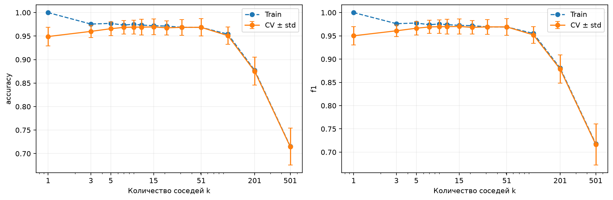

При k=1 обучающая accuracy равна 1, но CV accuracy составляет 0.9490: ближайшая шумная точка сильно влияет на ответ. При k=3–15 качество растёт; в этом срезе k=15 даёт 0.9695. Значения 7–51 дают близкие результаты. При k=201 и 501 качество падает до 0.8752 и 0.7148: модель чрезмерно сглаживает границу и смешивает два полумесяца. Это недообучение при слишком большом k.

### 3.3 Сравнение весов и устойчивость

В таблице зафиксирована euclidean; каждую пару uniform/distance нужно сравнивать при одинаковом k.

|   k | Веса     |   CV accuracy |   Std accuracy |   CV F1 |
|----:|:---------|--------------:|---------------:|--------:|
|   5 | uniform  |        0.9657 |         0.0148 |  0.9664 |
|  15 | uniform  |        0.9695 |         0.0167 |  0.9702 |
|  51 | uniform  |        0.9686 |         0.0185 |  0.9692 |
|   5 | distance |        0.9638 |         0.0154 |  0.9645 |
|  15 | distance |        0.9695 |         0.0170 |  0.9702 |
|  51 | distance |        0.9695 |         0.0158 |  0.9702 |

Uniform даёт каждому соседу одинаковый голос, distance — вес, обратный расстоянию. Определения соответствуют [KNeighborsClassifier](https://scikit-learn.org/stable/modules/generated/sklearn.neighbors.KNeighborsClassifier.html). На исходных данных преимущество distance не универсально: при k=5 оно хуже, при k=15 средняя accuracy совпадает. Train accuracy=1 у distance объясняется нулевым расстоянием объекта до самого себя и не доказывает обобщающую способность.

Средняя accuracy при изменении обучающих меток:

| Модель         |   Без смены меток |   10% смены меток |   20% смены меток |
|:---------------|------------------:|------------------:|------------------:|
| k=1, uniform   |            0.9483 |            0.8571 |            0.7600 |
| k=15, uniform  |            0.9689 |            0.9654 |            0.9566 |
| k=15, distance |            0.9674 |            0.9617 |            0.9357 |
| Выбрано по CV  |            0.9697 |            0.9666 |            0.9600 |

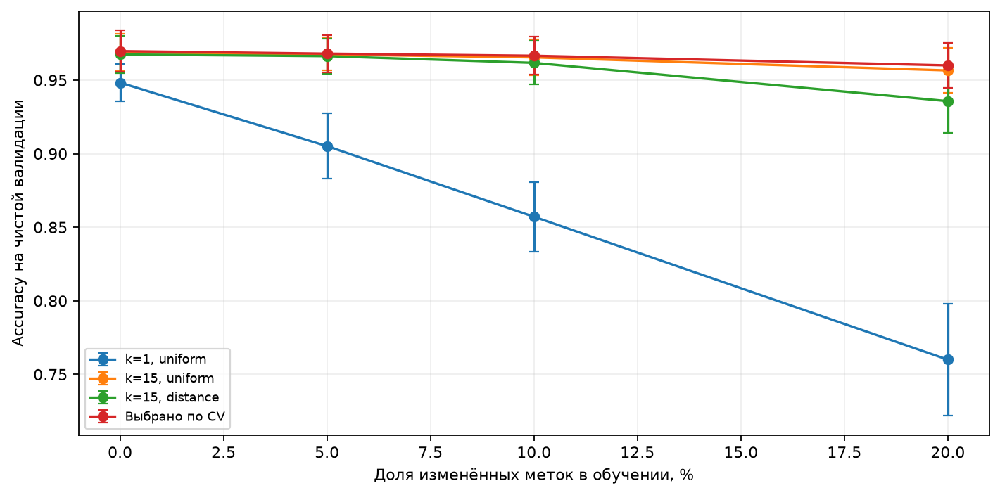

**Ответ об устойчивости:** при одинаковом k=15 и euclidean устойчивее uniform. При 20% изменённых меток оно сохраняет accuracy 0.9566 против 0.9357 у distance; усреднение уменьшает влияние отдельного неверно размеченного близкого соседа. Выбранная по CV конфигурация с k=51 сохраняет 0.9600: устойчивость определяется сочетанием k, весов и метрики, а не только weights.

### 3.4 Сравнение расстояний

Здесь зафиксированы k=15 и uniform. Дисперсии для seuclidean и обратная ковариационная матрица для Mahalanobis рассчитываются отдельно по обучающей части каждого CV-фолда. Валидационные и тестовые данные не используются для этих оценок.

| Метрика        |   CV accuracy |   Std accuracy |   CV F1 |
|:---------------|--------------:|---------------:|--------:|
| euclidean      |        0.9695 |         0.0167 |  0.9702 |
| manhattan      |        0.9695 |         0.0167 |  0.9701 |
| chebyshev      |        0.9686 |         0.0177 |  0.9692 |
| minkowski_p1   |        0.9695 |         0.0167 |  0.9701 |
| minkowski_p1.5 |        0.9686 |         0.0166 |  0.9692 |
| minkowski_p2   |        0.9695 |         0.0167 |  0.9702 |
| minkowski_p3   |        0.9686 |         0.0179 |  0.9692 |
| minkowski_p4   |        0.9686 |         0.0179 |  0.9692 |
| sqeuclidean    |        0.9695 |         0.0167 |  0.9702 |
| seuclidean     |        0.9690 |         0.0154 |  0.9697 |
| mahalanobis    |        0.9690 |         0.0182 |  0.9697 |
| cosine         |        0.8548 |         0.0196 |  0.8514 |
| correlation    |        0.8062 |         0.0271 |  0.8180 |
| canberra       |        0.9381 |         0.0178 |  0.9379 |
| braycurtis     |        0.9619 |         0.0184 |  0.9623 |

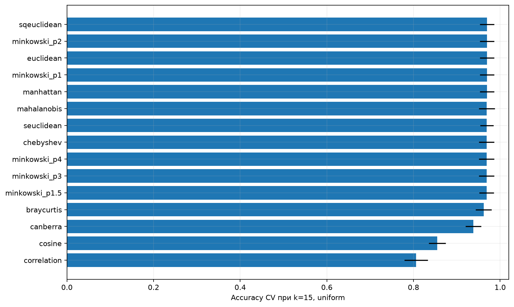

Euclidean и Manhattan сохраняют геометрию полумесяцев и в данном срезе дают одинаковую accuracy 0.9695. По дополнительному критерию F1 первым идёт **euclidean**. Minkowski(p=1) совпадает с Manhattan, Minkowski(p=2) — с Euclidean; sqeuclidean сохраняет порядок соседей при uniform, но меняет относительные веса при distance. Поэтому совпадения в таблице ожидаемы.

Cosine и correlation здесь существенно хуже: они отбрасывают информацию о расположении точек; в двух измерениях корреляционное расстояние особенно вырождено. Canberra и Bray–Curtis проверены как дополнительные меры различия, но Bray–Curtis на знаковых координатах нельзя трактовать как обычную геометрическую метрику. Формулы расстояний сверены с [SciPy cdist](https://docs.scipy.org/doc/scipy/reference/generated/scipy.spatial.distance.cdist.html).

Полный поиск включил 13 значений k × 2 варианта weights × 15 спецификаций расстояний = **390 конфигураций**, или 5850 обучений на CV. Лучшее сочетание — **k=51, weights=distance, metric=seuclidean**. Стандартизованное евклидово расстояние учитывает неодинаковый разброс двух координат. Его преимущество относится к совместному подбору параметров; при фиксированных k=15 и uniform лидируют другие строки.

**Почему не использованы остальные названия:** бинарные расстояния jaccard/dice/rogerstanimoto/russellrao/sokalmichener/sokalsneath/yule/kulsinski предназначены для бинарных признаков; Hamming/matching на непрерывных координатах почти всегда дают одинаковые расстояния. Haversine предназначена для географических координат, Jensen–Shannon — для распределений вероятностей. L1/cityblock и L2 являются псевдонимами; nan_euclidean без пропусков совпадает с euclidean. Precomputed означает готовую матрицу расстояний, callable — произвольную функцию. Эти варианты не образуют дополнительных содержательных сравнений на исходных данных.

### 3.5 Итог k-NN

| Модель                          |   Test accuracy |   Test F1 |
|:--------------------------------|----------------:|----------:|
| Ручной k=5, uniform, euclidean  |          0.9733 |    0.9718 |
| sklearn k=5, uniform, euclidean |          0.9733 |    0.9718 |
| Выбрано по CV                   |          0.9767 |    0.9756 |

Для выбранной конфигурации CV accuracy = **0.9714 ± 0.0140**, CV F1 = **0.9721**. На test: accuracy = **0.9767**, F1 = **0.9756**, ошибок **7 из 300**. Матрица ошибок: TN=153, FP=3, FN=4, TP=140.

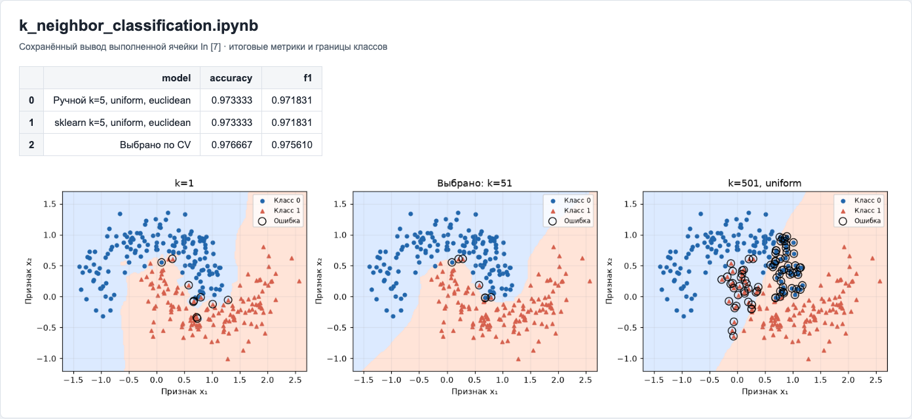

На изображении слева видны локальные неровности k=1, в центре — выбранная конфигурация, справа — чрезмерное сглаживание k=501. Чёрными окружностями отмечены ошибки. Скриншот сделан с HTML-представления сохранённого вывода выполненной ячейки, включая таблицу и визуализацию.

## 4 Задание 2 Дерево решений

### 4.1 Реализация алгоритма

Ручное дерево строится рекурсивно. Для каждого признака проверяются пороги между соседними уникальными значениями; выбирается минимальная взвешенная нечистота дочерних узлов. Реализованы Gini, entropy/log_loss, max_depth, min_samples_leaf и min_samples_split. В лист записывается класс большинства. Повторное обучение очищает предыдущее дерево; пустые дочерние ветви не создаются. Допускается промежуточное разбиение с нулевым уменьшением нечистоты, что проверено на XOR.

Проверены постоянные признаки, чистый класс, несколько классов, повторное обучение и ограничения размера/глубины. Корневые пороги сопоставлены со sklearn для трёх критериев. Возможные равнозначные пороги sklearn разрешает с учётом random_state, поэтому полное совпадение произвольных деревьев не требуется. На исходной задаче ручное дерево и базовое sklearn получили одинаковые итоговые метрики.

### 4.2 Как влияет глубина

Фиксированы gini, best, min_samples_leaf=1, min_samples_split=2, max_features=None, random_state=42.

| Глубина   |   Train accuracy |   CV accuracy |   Std accuracy |   CV F1 |
|:----------|-----------------:|--------------:|---------------:|--------:|
| 1         |           0.8321 |        0.7988 |         0.0479 |  0.8045 |
| 3         |           0.9140 |        0.8893 |         0.0303 |  0.8926 |
| 5         |           0.9893 |        0.9417 |         0.0320 |  0.9401 |
| 8         |           1.0000 |        0.9381 |         0.0337 |  0.9377 |
| 12        |           1.0000 |        0.9381 |         0.0337 |  0.9377 |
| 20        |           1.0000 |        0.9381 |         0.0337 |  0.9377 |
| None      |           1.0000 |        0.9381 |         0.0337 |  0.9377 |

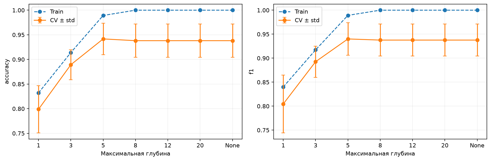

Глубина 1 даёт CV accuracy 0.7988: дерево слишком простое. При глубине 3 она растёт до 0.8893, при 5 — до 0.9417. С глубины 8 обучающая accuracy равна 1, а CV снижается до 0.9381. Дальнейшее увеличение ограничения ничего не меняет: дерево уже исчерпало полезные разбиения на обучении. Таким образом, для этого среза **max_depth=5** предпочтительнее глубокой неограниченной модели.

### 4.3 Критерии и стратегии разбиения

Сравнение при max_depth=5, leaf=1, split=2, max_features=None, random_state=42:

| Критерий   | Splitter   |   CV accuracy |   Std accuracy |   CV F1 |
|:-----------|:-----------|--------------:|---------------:|--------:|
| gini       | best       |        0.9417 |         0.0320 |  0.9401 |
| gini       | random     |        0.9131 |         0.0356 |  0.9059 |
| entropy    | best       |        0.9512 |         0.0218 |  0.9499 |
| entropy    | random     |        0.8952 |         0.0323 |  0.8828 |
| log_loss   | best       |        0.9512 |         0.0218 |  0.9499 |
| log_loss   | random     |        0.8952 |         0.0323 |  0.8828 |

При splitter=best критерии entropy и log_loss дают CV accuracy 0.9512 против 0.9417 у gini. Их совпадение объясняется тем, что оба используют информационный выигрыш Шеннона. При той же глубине random хуже best для всех трёх критериев. Определения критериев и параметров проверены по [DecisionTreeClassifier](https://scikit-learn.org/stable/modules/generated/sklearn.tree.DecisionTreeClassifier.html).

Для отдельной проверки случайности проведены 20 запусков каждого splitter с seeds 0–19 при глубине 5 и gini. В каждом запуске вычислена средняя по тем же 15 CV-фолдам, затем измерен разброс между seeds:

| Splitter   |   Средняя accuracy |   Std между seed |   Средняя F1 |
|:-----------|-------------------:|-----------------:|-------------:|
| best       |             0.9420 |           0.0005 |       0.9404 |
| random     |             0.8761 |           0.0340 |       0.8780 |

**Ответ об устойчивости:** при одинаковой глубине best здесь значительно стабильнее random. Std между seeds равно 0.00053 у best и 0.03396 у random. Фиксация random_state обеспечивает воспроизводимость конкретного дерева, но сама по себе не делает модель устойчивой к другой выборке или шуму.

### 4.4 Минимальные размеры узлов и число признаков

Для leaf/split использованы gini, best, глубина None, max_features=None.

|   min_samples_leaf |   min_samples_split |   Train accuracy |   CV accuracy |   Std accuracy |   CV F1 |
|-------------------:|--------------------:|-----------------:|--------------:|---------------:|--------:|
|                  1 |                   2 |           1.0000 |        0.9381 |         0.0337 |  0.9377 |
|                  1 |                   5 |           0.9932 |        0.9369 |         0.0343 |  0.9362 |
|                  1 |                  10 |           0.9890 |        0.9345 |         0.0380 |  0.9344 |
|                  3 |                   2 |           0.9833 |        0.9417 |         0.0327 |  0.9413 |
|                  3 |                   5 |           0.9833 |        0.9417 |         0.0327 |  0.9413 |
|                  3 |                  10 |           0.9815 |        0.9381 |         0.0369 |  0.9381 |
|                  5 |                   2 |           0.9780 |        0.9369 |         0.0404 |  0.9372 |
|                  5 |                   5 |           0.9780 |        0.9369 |         0.0404 |  0.9372 |
|                  5 |                  10 |           0.9780 |        0.9369 |         0.0404 |  0.9372 |
|                 10 |                   2 |           0.9622 |        0.9250 |         0.0365 |  0.9232 |
|                 10 |                   5 |           0.9622 |        0.9250 |         0.0365 |  0.9232 |
|                 10 |                  10 |           0.9622 |        0.9250 |         0.0365 |  0.9232 |

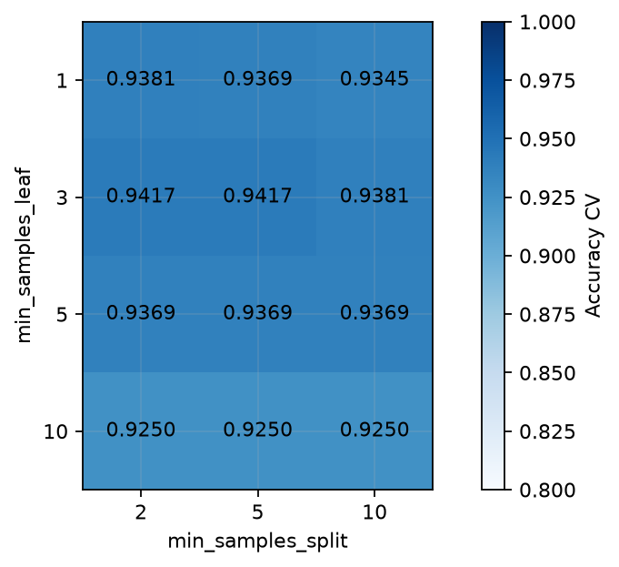

Небольшое увеличение min_samples_leaf до 3 улучшает CV accuracy с 0.9381 до 0.9417. Значение 10 снижает её до 0.9250 на исходных данных. Рост min_samples_split сам по себе не гарантирует улучшения: при leaf=1 значение split=10 уменьшает качество до 0.9345. Ограничения взаимодействуют: если leaf=5, разбиению всё равно нужны минимум 10 объектов, поэтому split=2, 5 и 10 здесь эквивалентны.

При сравнении max_features фиксированы depth=5, gini, best, leaf=1, split=2:

| max_features   |   CV accuracy |   Std accuracy |   CV F1 |
|:---------------|--------------:|---------------:|--------:|
| None           |        0.9417 |         0.0320 |  0.9401 |
| sqrt           |        0.8952 |         0.0556 |  0.8966 |
| log2           |        0.8952 |         0.0556 |  0.8966 |
| 0.25           |        0.8952 |         0.0556 |  0.8966 |
| 0.5            |        0.8952 |         0.0556 |  0.8966 |

**Лучший max_features в этом срезе — None.** У данных всего два признака; sqrt, log2, 0.25 и 0.5 задают один рассматриваемый признак на узел и здесь дают одинаковые результаты. Отбрасывание одного из двух полезных признаков уменьшает CV accuracy до 0.8952 и увеличивает разброс. Это не доказывает вред случайного выбора признаков для ансамблей или многомерных данных.

### 4.5 Обобщение и устойчивость к шуму

Средняя accuracy на чистой валидации при повреждении обучающих меток:

| Модель          |   Без смены меток |   10% смены меток |   20% смены меток |
|:----------------|------------------:|------------------:|------------------:|
| Без ограничений |            0.9493 |            0.8564 |            0.7786 |
| depth=3         |            0.8900 |            0.8850 |            0.8800 |
| depth=5         |            0.9471 |            0.9064 |            0.8664 |
| leaf=5          |            0.9479 |            0.8943 |            0.8186 |
| leaf=10         |            0.9264 |            0.9186 |            0.8771 |
| Выбрано по CV   |            0.9364 |            0.8779 |            0.7950 |

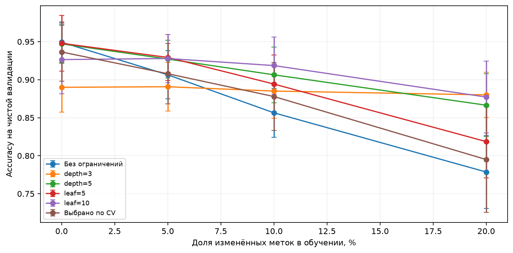

При 20% изменённых меток дерево без ограничений падает до 0.7786; depth=3 сохраняет 0.8800, leaf=10 — 0.8771, depth=5 — 0.8664. Ограничение глубины и минимального размера листа мешает запоминать отдельные ошибочные метки. При отсутствии дополнительного шума depth=3 заметно недообучается (0.8900 против 0.9493 у дерева без ограничений). Поэтому **усиленная регуляризация оправданна при более шумных метках**, а не безусловно для любой задачи.

### 4.6 Итог дерева

Перебраны 7 глубин × 3 критерия × 2 splitter × 4 leaf × 3 split × 5 max_features = **2520 конфигураций**, или **37 800 обучений** на CV.

Максимум в этой сетке при random_state=42 получен с параметрами:

```python
{
    "max_depth": 12,
    "criterion": "gini",
    "splitter": "random",
    "min_samples_leaf": 1,
    "min_samples_split": 5,
    "max_features": None,
    "random_state": 42
}
```

CV accuracy = **0.9536 ± 0.0241**, CV F1 = **0.9532**. На test: accuracy = **0.9667**, F1 = **0.9655**, **4 ошибки из 120**. Фактическая глубина обученного дерева — 12, листьев — 35.

| Модель                  |   Test accuracy |   Test F1 |
|:------------------------|----------------:|----------:|
| Ручное дерево           |          0.9417 |    0.9402 |
| sklearn без ограничений |          0.9417 |    0.9402 |
| Выбрано по CV           |          0.9667 |    0.9655 |

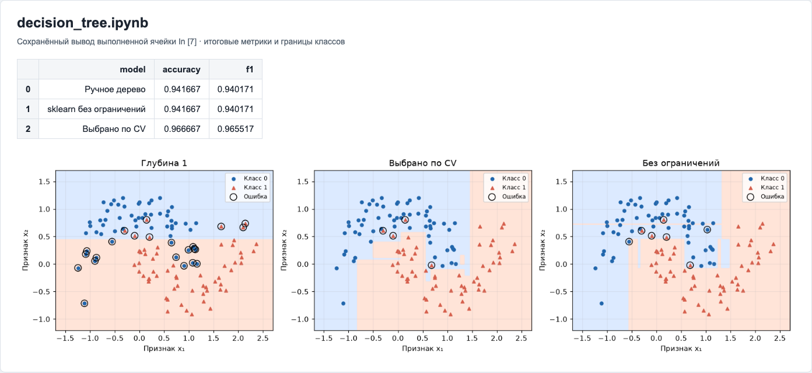

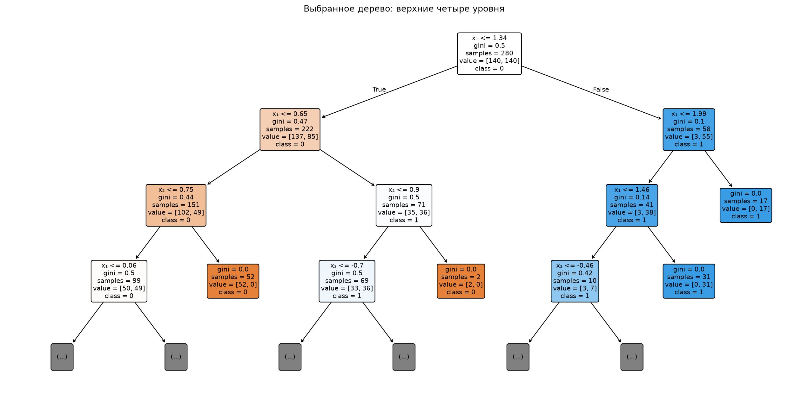

Многоточие на схеме означает продолжение дерева ниже четвёртого отображённого уровня. Параметры, обучение и весь объект дерева воспроизводятся кодом блокнота.

**Максимум качества и устойчивость — разные выводы.** Победитель с random достиг лучшей CV accuracy при фиксированном seed, но в опыте с изменением меток и seeds не оказался самым устойчивым. Более простой вариант depth=5, entropy/log_loss, best, leaf=1, split=2, max_features=None даёт близкую CV accuracy 0.9512 (на 0.0024 меньше максимума); это разумный кандидат, если приоритет — простота. Для доказательства его устойчивости при повторных seeds нужен отдельный опыт именно с этим критерием. Превосходство победителя на 0.0024 не следует считать статистически доказанным.

## 5 Дополнительная часть Регрессия

### 5.1 Что заполнено и исправлено

В `regression_task_1.ipynb` сохранены без изменения все 300 исходных пар x/y. Устранена неявная подмена данных: три набора хранятся раздельно, `DATA_VARIANT=1` выбирает набор для пошагового примера. Для всех трёх вариантов отдельно выполнен подбор полиномов, Ridge и Lasso.

Заполнены матричные формулы степеней 1 и 2, написан полином степени 3, рассчитаны потери степеней 0–9, добавлены настоящая кроссвалидация и обучение с регуляризацией. Реализован градиентный спуск и сравнение с sklearn/statsmodels. Все промежуточные таблицы и графики сохранены в блокноте.

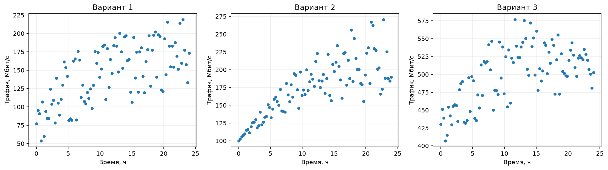

### 5.2 Матричная форма и выбор степени

При X=[1,x,…,xᵈ] использована формула θ=(XᵀX)⁻¹Xᵀy. Все три решения проверены через `np.linalg.lstsq` с допуском 1e−7. Ниже результаты на всех 100 точках варианта 1; это обучающие оценки.

|   Степень | Коэффициенты                                |   Train MSE |   Train R² |    cond(X) |
|----------:|:--------------------------------------------|------------:|-----------:|-----------:|
|         1 | [101.302021, 3.674020]                      |    876.7285 |     0.4299 |    27.6824 |
|         2 | [79.987456, 9.057035, -0.224292]            |    780.2471 |     0.4926 |   774.8821 |
|         3 | [76.882115, 10.649859, -0.391048, 0.004632] |    778.6939 |     0.4936 | 21419.3792 |

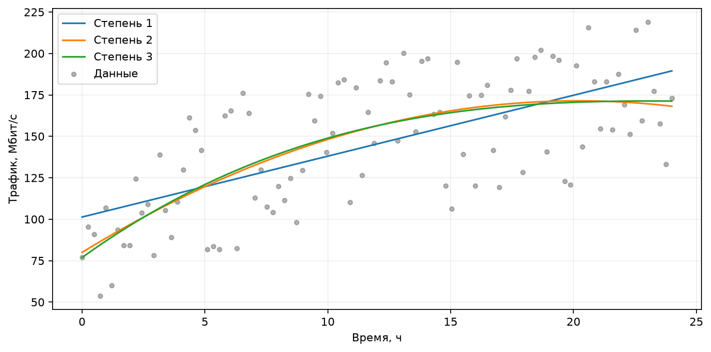

Для выбора сложности использована MSE=mean((y−ŷ)²), степени 0–9, пятичастная CV только на 50 обучающих объектах. Степень с минимальной CV MSE — **2**.

|   Степень |   Train MSE |    CV MSE |   Std MSE |   Test MSE |
|----------:|------------:|----------:|----------:|-----------:|
|         0 |   1458.8907 | 1714.5247 |  832.1730 |  1617.0848 |
|         1 |    870.7960 | 1084.0341 |  303.4927 |   883.6859 |
|         2 |    765.3964 | 1023.9616 |  404.0757 |   798.6472 |
|         3 |    764.9295 | 1076.1402 |  382.9396 |   803.9483 |
|         4 |    764.9294 | 1119.6542 |  366.2366 |   803.9134 |
|         5 |    762.9313 | 1260.8157 |  314.5090 |   812.0515 |
|         6 |    736.0761 | 1294.3285 |  362.1810 |   806.0346 |
|         7 |    683.1801 | 1134.4772 |  343.2953 |   908.8949 |
|         8 |    681.2638 | 1383.7211 |  650.3385 |   880.2936 |
|         9 |    679.5667 | 2029.6721 | 1784.0983 |   890.5106 |

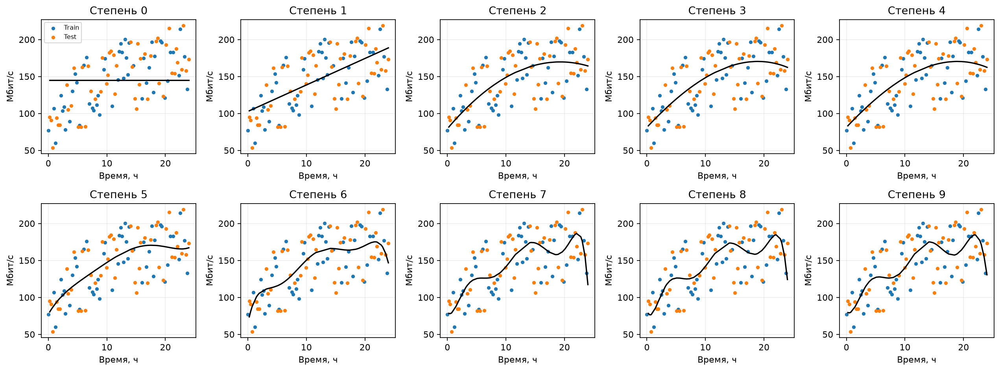

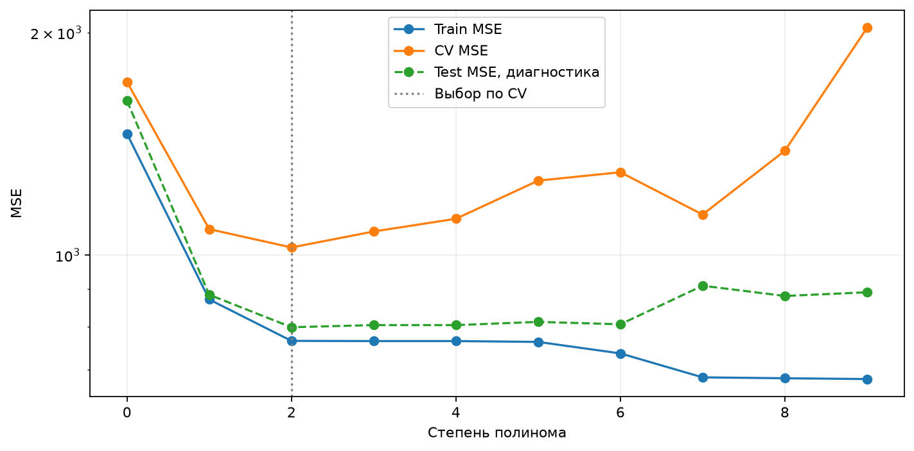

Test MSE для всех степеней показана как диагностика после фиксации выбора; степень по test не подбиралась. Рост степени уменьшает обучающую ошибку, но может ухудшать CV/test и обусловленность. Меньшая train MSE сама по себе не является основанием увеличивать степень.

### 5.3 Регуляризация

Сначала заполнены формулы исходной заготовки с L=1: Ridge objective = MSE/2 + L·Σθⱼ²/(2m), Lasso objective = MSE/2 + L·Σ|θⱼ|, без штрафа свободного члена. Эти значения на коэффициентах `np.polyfit` сохранены в `results/regression_penalties.csv` и являются диагностикой: добавление штрафа после OLS не изменяет модель.

Затем действительно обучены Ridge и Lasso с центрированием/масштабированием x до построения степеней и масштабированием полученных столбцов. Обе StandardScaler обучаются внутри каждого фолда; использованы степенями 1–9 и alpha ∈ {0.01, 0.1, 1, 10, 100}. Ridge минимизирует RSS+alpha·L2², Lasso — RSS/(2m)+alpha·L1, поэтому одинаковые числа alpha не означают одинаковую силу штрафа. Lasso решается методом LARS через [LassoLars](https://scikit-learn.org/stable/modules/generated/sklearn.linear_model.LassoLars.html); для каждого решения независимо проверены условия оптимальности KKT с допуском 1e−5. См. определения [Ridge](https://scikit-learn.org/stable/modules/generated/sklearn.linear_model.Ridge.html) и [Lasso](https://scikit-learn.org/stable/modules/generated/sklearn.linear_model.Lasso.html).

| Метод   |   Степень |   alpha |    CV MSE |   Std MSE |   Train MSE |   Test MSE |   Test R² |
|:--------|----------:|--------:|----------:|----------:|------------:|-----------:|----------:|
| Ridge   |         2 |  1.0000 | 1022.9739 |  401.0840 |    765.6808 |   800.0500 |    0.5050 |
| Lasso   |         2 |  0.0100 | 1023.9973 |  403.9095 |    765.3966 |   798.6482 |    0.5058 |

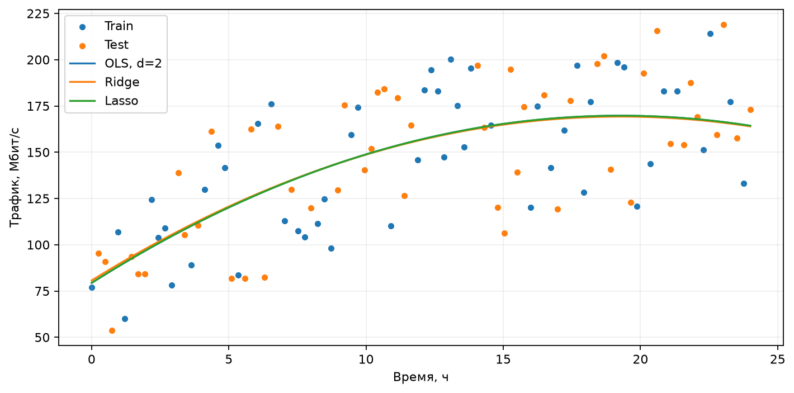

Регуляризация ограничивает коэффициенты, но не обязана улучшать результат каждого конкретного тестового разбиения. Сравнивать методы нужно по CV MSE и отложенным метрикам, а не по числам их разных штрафных функций.

### 5.4 Градиентный спуск и библиотечные решения

Реализованы J=||y−Xθ||²/(2m) и θ←θ+α·Xᵀ(y−Xθ)/m. Шаг α=0.01, число итераций — 1000. Признак x стандартизован для устойчивой сходимости, после чего коэффициенты возвращены в исходные единицы. Выполнены все итерации; на рисунке прямых показаны девять состояний для читаемости.

- Градиентный спуск: θ₀=101.297647, θ₁=3.673862.
- Матричное решение: θ₀=101.302021, θ₁=3.674020.
- Финальное J = 438.364249; значения конечны и монотонно убывают.
- Коэффициенты градиентного спуска совпали с точным решением при относительном допуске 5e−5; sklearn и statsmodels проверены с абсолютным допуском 1e−10.

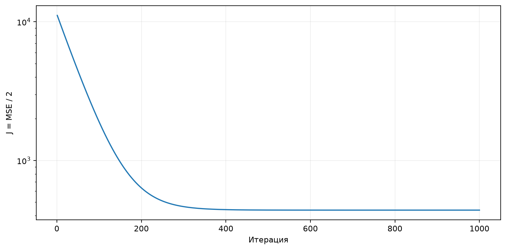

### 5.5 Интерпретация statsmodels

Для варианта 1 линейная модель на всех 100 точках имеет вид **ŷ=101.3020+3.6740·x**. Наклон выражен в Мбит/с за час, свободный член — оценка трафика при x=0. R²=0.4299, скорректированный R²=0.4240; линейная зависимость описывает часть разброса, но не всё.

F=73.8876, p(F)=1.34e-13: при стандартных предпосылках OLS модель с наклоном отличается от модели с одной константой. Это не доказательство причинного влияния времени. AIC=965.41, BIC=970.62 полезны для сравнения моделей на тех же наблюдениях.

В блокноте объяснены все поля summary: Dep. Variable, Model, R²/Adj. R², F/p(F), Log-Likelihood, AIC/BIC, coef, std err, t, p-value, доверительные интервалы, Omnibus, Durbin–Watson, Jarque–Bera, Skew, Kurtosis и Cond. No. Исправлено пояснение Kurtosis: это куртозис (норма 3), а не эксцесс (норма 0). Добавлены робастные ошибки HC3. Статистическая значимость коэффициента не заменяет оценку прогноза на test.

### 5.6 Итоги для всех трёх наборов

|   Вариант | Метод       |   Степень |   alpha |    CV MSE |   Std MSE |   Test MSE |   Test R² |
|----------:|:------------|----------:|--------:|----------:|----------:|-----------:|----------:|
|         1 | OLS polyfit |         2 |  0.0000 | 1023.9616 |  404.0757 |   798.6472 |    0.5058 |
|         1 | Ridge       |         2 |  1.0000 | 1022.9739 |  401.0840 |   800.0500 |    0.5050 |
|         1 | Lasso       |         2 |  0.0100 | 1023.9973 |  403.9095 |   798.6482 |    0.5058 |
|         2 | OLS polyfit |         2 |  0.0000 |  553.2250 |  402.0969 |   394.8476 |    0.7518 |
|         2 | Ridge       |         2 |  1.0000 |  552.9118 |  409.5629 |   398.5237 |    0.7495 |
|         2 | Lasso       |         2 |  0.0100 |  553.2300 |  402.2364 |   394.8994 |    0.7517 |
|         3 | OLS polyfit |         2 |  0.0000 |  759.8566 |  187.4479 |   808.8142 |    0.4812 |
|         3 | Ridge       |         9 |  0.1000 |  757.1901 |  278.5787 |   835.4489 |    0.4641 |
|         3 | Lasso       |         2 |  0.0100 |  759.9288 |  187.6671 |   808.7395 |    0.4812 |

Степень и alpha выбраны отдельно внутри каждой семьи по CV. Таблица не использовалась для повторного подбора по test. Для варианта 1 наименьшая CV MSE среди трёх выбранных моделей у **Ridge**; для варианта 2 — **Ridge**; для варианта 3 — **Ridge**.

При дальнейшем исследовании можно сравнивать сплайны, k-NN-регрессию, деревья, ансамбли и SVR. Текущий случайный train/test проверяет интерполяцию внутри диапазона 0–24 ч, а не прогноз будущего временного ряда.

## 6 Проверка и воспроизведение

Все три блокнота выполнены сверху вниз в отдельных чистых ядрах; сохранены номера выполнения, численные результаты, таблицы и графики. Старые outputs заменены результатами нового запуска. Ручные алгоритмы проверены на контрольных примерах, регрессионные решения — независимыми формулами и библиотеками. У Lasso предупреждение о несходимости считается ошибкой запуска; выполнено 679 проверок KKT, максимальное нарушение условий оптимальности — 3.41e-13.

Рабочая среда: Python 3.12.14, NumPy 2.5.3, pandas 3.0.5, SciPy 1.18.1, scikit-learn 1.9.0, Matplotlib 3.11.1, statsmodels 0.15.0. Полный список версий закреплён в `requirements.txt`.

Повторный запуск из папки с блокнотами:

```bash
cd /Users/rammls/Projects/Labs-IB/other-discipline/ml
python3 -m venv .venv
.venv/bin/python -m pip install -r requirements.txt
.venv/bin/python run_notebooks.py
.venv/bin/python build_report.py
.venv/bin/python validate_results.py
```

Для воспроизведения использован Python 3.12.14. Уже созданное `.venv` готово к работе: создание окружения и установку пакетов можно пропустить. Для одного блокнота передайте его имя, например `.venv/bin/python run_notebooks.py decision_tree.ipynb`. В Jupyter/VS Code нужно выбрать интерпретатор `.venv/bin/python` и выполнять из этой папки. `ml_utils.py` должен находиться рядом с блокнотами.

Полные данные экспериментов: [k-NN](results/knn_grid.csv), [дерево](results/tree_grid.csv), [регрессия по трём вариантам](results/regression_all_variants.csv). Папку `results/figures` нужно сохранять вместе с Markdown-отчётом, чтобы отображались изображения. Графики построены по фактическим расчётам. Два скриншота в разделах 3.5 и 4.6 сняты с HTML-представления сохранённых результатов блокнотов; соответствие их исходным outputs проверяется по SHA-256.

## 7 Общий вывод

Для исходных полумесяцев лучший найденный k-NN — **k=51, distance, seuclidean**, тестовая accuracy **97.67%**. При фиксированном k=15 веса uniform устойчивее к ошибочным обучающим меткам. Euclidean/Manhattan подходят для геометрии данных; результат стандартизованного расстояния улучшился при совместном подборе k и weights.

Лучшее найденное дерево при seed=42 — **depth=12, gini, random, leaf=1, split=5, max_features=None**, тестовая accuracy **96.67%**. При глубине 5 splitter=best стабильнее random; при сильном шуме меток помогают меньшая глубина и более крупные листья. Максимум CV в конкретной сетке не равен универсально лучшей или самой устойчивой модели.

В регрессии заполнены все предусмотренные методы и подтверждено согласование независимых решений линейной задачи. Выбор сложности основан на CV, регуляризация действительно обучена, а все три исходных варианта рассчитаны отдельно.
